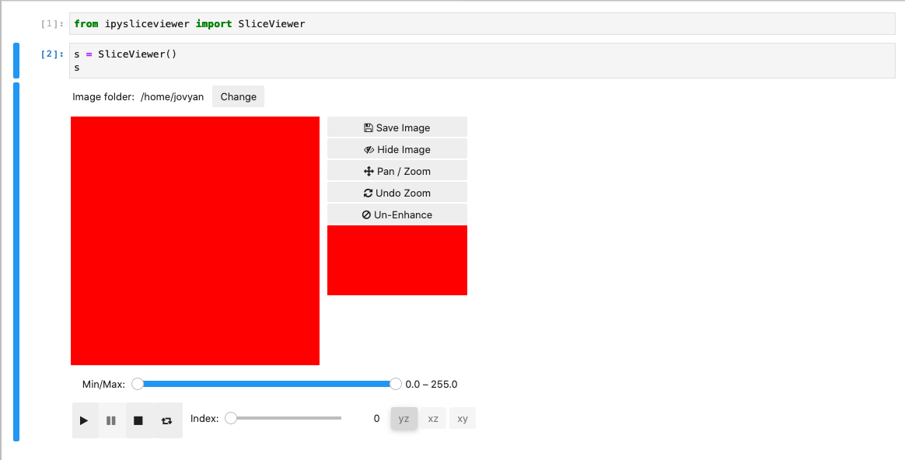

# ipysliceviewer

An IPyWidget for viewing cross-sections of objects

## Usage

    from ipysliceviewer import SliceViewer
    SliceViewer(volume=None, default_directory='.')

* Setting the default directory will set that as the image directory and look for image files, but that path can be changed using the ipypathchooser interface.
* SliceViewer will also accept a numpy array in 'volume', which can represent data from one or more images.

## Installation
#### Dependencies

---

##### ipypathchooser widget
* [Installation README](https://github.com/nersc/ipypathchooser/blob/master/README.md)

##### bqplot library (python bqplot==0.11.9, javascript bqplot@0.4.9)
* The python library will be installed with ipysliceviewer
* See below for instructions on installing the bqplot extension

#### ipysliceviewer            

---

##### To install the python code:
    $ git clone https://github.com/nersc/ipysliceviewer
    $ cd ipysliceviewer
    $ pip install .

##### For a jupyterlab install
    $ cd js
    $ npm install
    $ npm run build
    $ jupyter labextension install

##### To install widget code for the classic jupyter notebook interface
    $ jupyter nbextension enable --py --sys-prefix ipypathchooser
    $ jupyter nbextension enable --py --sys-prefix bqplot@0.4.9
    $ jupyter nbextension enable --py --sys-prefix ipysliceviewer
    
##### To install widget code for jupyterlab
    $ jupyter labextension install @jupyter-widgets/jupyterlab-manager@1.1
    $ jupyter labextension install ipypathchooser bqplot@0.4.9 ipysliceviewer

#### Developers

---

##### For a development python installation after dependencies are installed,
    $ pip install -e .
    
##### For a classic notebook interface install
    $ jupyter nbextension install --py --symlink --sys-prefix ipysliceviewer
    $ jupyter nbextension enable --py --sys-prefix ipysliceviewer
